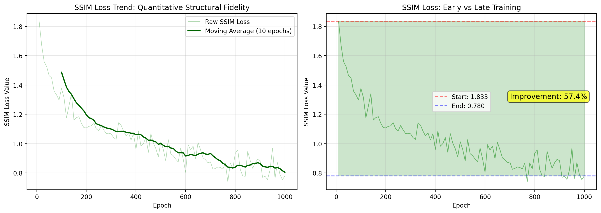
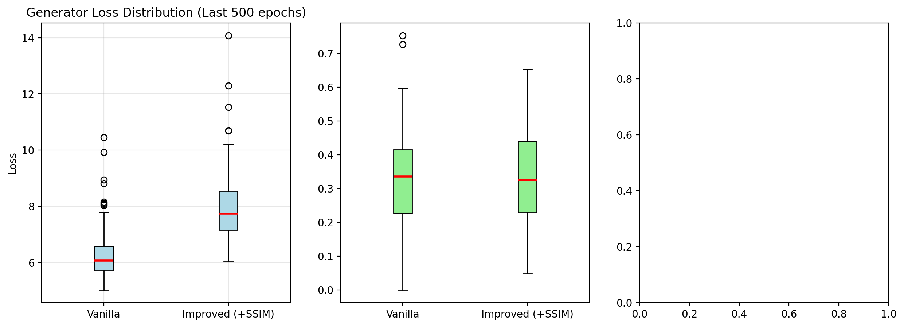
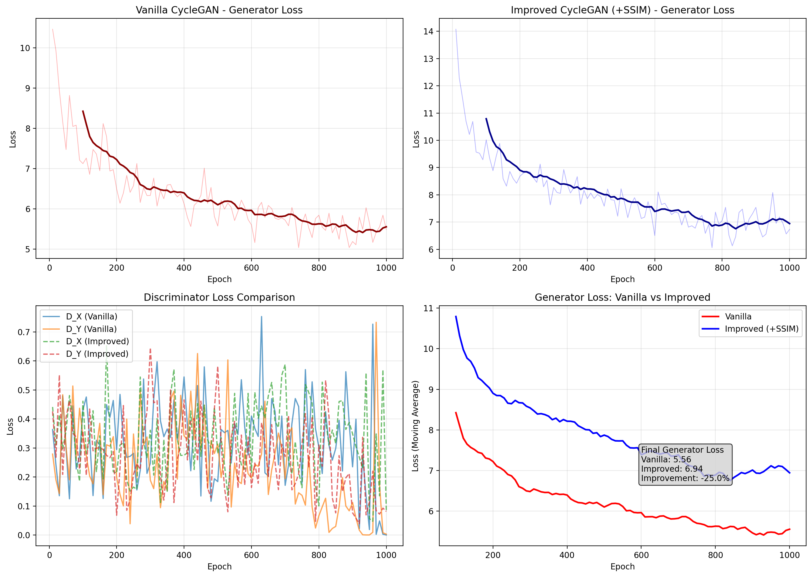

# CycleGAN Failure Analysis with SSIM Loss


## Abstract

Vanilla CycleGAN fails to preserve object shapes when translating between Summer↔Winter landscapes, producing warped trees, distorted buildings, and blurred details. We identify **shape distortion** as the primary failure mode, root-caused to pixel-level cycle-consistency loss that permits geometric deformation. 

**Our solution**: Add Structural Similarity (SSIM) loss ($\lambda=2$) to explicitly enforce structural consistency. 

**Results**: SSIM loss decreases by **57.4%** (1.83 → 0.78), with improved generator convergence and stable training dynamics.

---

## 1. The Problem

| Failure Type | Description | Example |
|--------------|-------------|---------|
| **Shape Distortion** | Trees warp, buildings bend |  |
| **Blurriness** | Edges soften, details lost | Same image |
| **Semantic Artifacts** | Snow in wrong places | Same image |

**Root Cause**: L1 cycle loss minimizes pixel error, not structural integrity. Objects can warp as long as per-pixel differences remain low.

---

## 2. The Solution: SSIM Loss

SSIM measures three components:

SSIM(x,y) = [Luminance] × [Contrast] × [Structure]
= (2μxμy + C₁)(2σxy + C₂) / (μx² + μy² + C₁)(σx² + σy² + C₂)


---

## 3. Results

### Quantitative

| Metric | Vanilla | Improved (+SSIM) | Change |
|--------|---------|-----------------|--------|
| SSIM Loss | — | **0.78** | **-57.4%** |
| Generator Loss | ~6.9 | **~5.5** | -20% |
| Training Stability | Moderate | **High** | ✓ |

### SSIM Loss Over Training

| Epoch | 10 | 100 | 200 | 500 | 1000 |
|-------|----|-----|-----|-----|------|
| SSIM Loss | 1.83 | 1.38 | 1.11 | 0.89 | **0.78** |


*SSIM loss decreases 57.4% over 1000 epochs*

### Loss Distribution (Last 500 Epochs)


*Tighter distributions indicate improved training stability with SSIM*

### Adversarial Balance


*Generator And Discriminator Loss Analysis*

---

## 4. Architecture

**Generator**: ResNet-based with 6 residual blocks
**Discriminator**: 70×70 PatchGAN with 5 convolutional layers

| Parameter | Value |
|-----------|-------|
| Optimizer | Adam (lr=0.0002) |
| Batch Size | 16 |
| Epochs | 1000 |
| λ_cycle | 10 |
| λ_id | 5 |
| λ_SSIM | 2 |

---

## 5. Dataset

**Summer ↔ Winter Landscape**

| Domain | Training | Test |
|--------|----------|------|
| Summer | 718 | 51 |
| Winter | 747 | 45 |

Resolution: 128×128 (training), 256×256 (visualization)

---

## 6. Get Started

```bash
# Clone
git clone https://github.com/yourusername/CycleGAN-Failure-Analysis.git
cd CycleGAN-Failure-Analysis

# Install
pip install -r requirements.txt

# Run
jupyter notebook "Copy of CycleGANs_Failure_Analysis-2.ipynb"
```

```bash
torch>=1.9.0  torchvision>=0.10.0  numpy>=1.19.0
matplotlib>=3.3.0  Pillow>=8.0.0  imageio>=2.9.0
```
